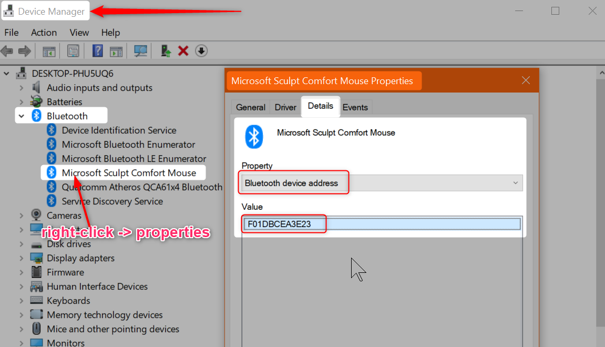

# btRemover
Unpair and remove your Bluetooth device from Windows 10, even when the standard Windows 10 methods won't work or when the device keeps coming back on it's own.

_If you want the long, boring story, scroll to the end. Basically, if your Windows 10 is having trouble removing a bluetooth device (eg. fails, or pretends to remove but then does not re-pair and the old "zombie" pairing comes back after restart, etc); then this little piece of code may actually resolve your problem._


Well, before anything, if you just want to run the tool you can download it from my Dropbox [here](https://www.dropbox.com/s/8ht4pdrr9p47uft/btRemover.zip?dl=1). But you should never just trust random EXE's that you download from the web, so here's how you can build it yourself:

## instructions
1. You will need a C# IDE like Visual Studio or [SharpDevelop](http://www.icsharpcode.net) - this is what I used because of the portability _(no need to install, just copy the folder and run the exe)_ and no admin rights required, they call the portable version "Xcopyable Installation" and can be downloaded from [SourceForge](https://sourceforge.net/projects/sharpdevelop/files/SharpDevelop%205.x/5.1/SharpDevelop_5.1.0.5216_Xcopyable.zip/download)
2. Create a new C# command-line application project (call it ```btRemover``` to make your life easier when pasting)
3. Put the source code (```Program.cs```) in it (make sure namespace & main class names match, right...)
4. Build the solution, then go to the output folder and call the command-line tool passing in the stubborn device's bluetooth address.

## Q&A
Q: But where do I get the device's address?
A: Windows -> Device Manager -> Bluetooth -> right-click your device -> properties -> details -> select "Bluetooth device address" Screenshot:


Q: Why didn't you make the program list the devices to make it easier?
A: Laziness - I actually looked into it for a few minutes, but it wasn't so clear right away so I didn't think it was worth it to invest any effort into doing this, since this tool is only required ONCE and in quite rare cases.

And there you go.

-----
### Now full story for those interested


Some people (actually seems to be quite a lot of people but most importantly: me) are having trouble removing Bluetooth devices from Windows 10 sometimes. There doesn't seem to be a common cause and it seems to be quite random, very difficult to replicate on purpose. See more on this [Microsoft Community post](https://answers.microsoft.com/en-us/windows/forum/windows_10-networking-winpc/unable-to-remove-bluetooth-device-on-windows-10/ea6da83d-583e-4b80-8714-367510879f07)

The first time that this happened to me, I formatted the PC; I keep all my "user folders" (eg. desktop, etc) on an online storage service (like OneDrive, but I actually use another) and I use a few different online services for my work; I try to keep my digital life as "portable" as possible so that I don't get stuck on a single PC. So this was an easy solution.

The second time this happened, I saved my stuff and was about to go to another PC to continue working while this one was formatted and I thought; "wait, I remember on that Microsoft post that someone mentioned some command-line tools that could resolve this", the problem seems to be quite common with my configuration (Microsoft Surface Go (windows-store-only-or-something-mode disabled/removed) + Microsoft Sculpt Mouse) so that just sounded like a better solution.

I visited the site that had the command-line tools and... it has loads of low-quality ads everywhere, popups and pop-unders. Really horrible and _iffy-looking_, but OK, the devs of this tool are free to try and make their site as profitable as possible, maybe... whatever; let me check the tools and.... wait a sec... the tools HAVE to be installed, they cannot be extracted from a zip and the installation REQUIRES *admin rights*.... fishy fishy fishy. I'm not downloading that, thank you very much. My PC's virus-free, just the way I like it.

So I closed the fishy site _(don't get me wrong, it might be completely legitimate and honest and virus-free; but it smells just too bad so I won't go near it)_ and proceeded to the original idea of going back to format/restore windows, whatever...

Then I thought.... wait, I know C++, it might just not be all that hard to create a little program that does whatever this supposed tool does; let me look into this. But I have a nice & easy, portable C# IDE on my Sync drive so let's see if C# could do it, so I found [this Stack Overflow post](https://stackoverflow.com/questions/53746671/how-to-unpair-remove-bluetooth-device-in-windows-with-c-sharp-net) which mentions a simple call to the function BluetoothRemoveDevice in the windows standard bluetooth dll.... I thought; well that's just too simple and most likely what the windows screen does so this won't work for sure, but let's start from here.

**well, it worked** so here's the full code and usage instructions for anyone to use.
